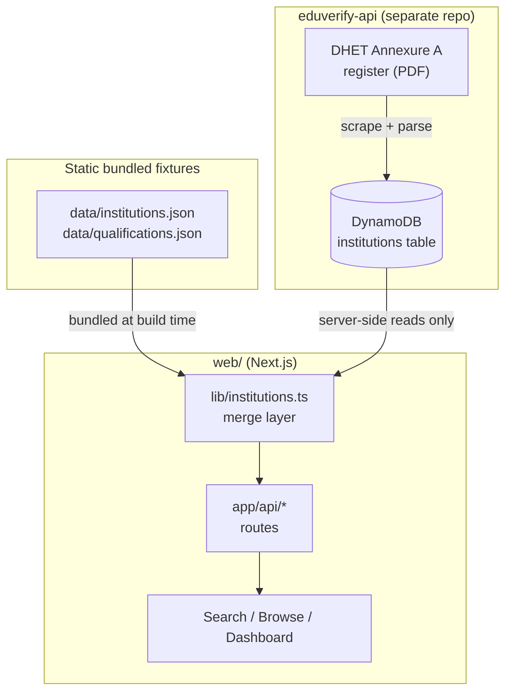
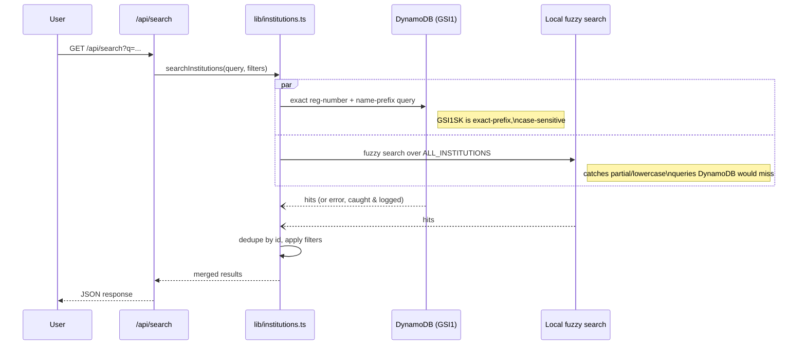
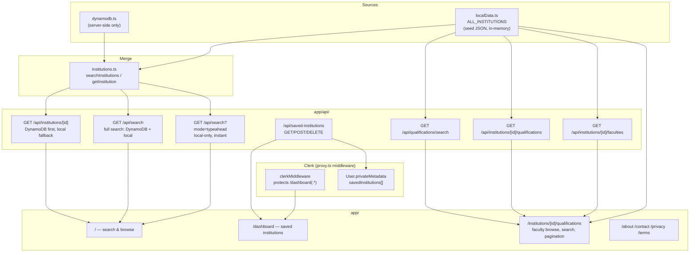

# EduVerify

EduVerify is a lookup tool for South African higher-education institutions — public universities, TVET colleges, and DHET-registered private providers — so anyone can verify that a qualification or provider is legitimate.

The repository has two parts:

| Part | What it does |
|---|---|
| [`web/`](web/) | Next.js product — search/browse UI, dashboard, API routes |
| [`terraform/`](terraform/) + [`scripts/`](scripts/) | AWS infra for `web/` itself: the DynamoDB table it reads from, Amplify hosting, and the CI/OIDC deploy role |

Institution and qualification data (scraping the DHET "Annexure A" register and the SAQA NLRD qualifications register, and writing the live DynamoDB table) is no longer this repo's job — that ingestion pipeline now lives entirely in the sibling `eduverify-api` repo. This repo keeps [`data/institutions.json`](data/institutions.json) and `data/qualifications.json` committed as static bundled fixtures for local dev, but has no mechanism left to regenerate them itself.

## Contents

- [System architecture](#system-architecture)
- [Data flow](#data-flow)
- [AWS infrastructure](#aws-infrastructure)
- [Web app](#web-app)
- [Repository layout](#repository-layout)
- [Getting started](#getting-started)
- [Testing](#testing)

## System architecture



`web/` never writes to DynamoDB — it only reads the table `eduverify-api` populates. The static `data/*.json` fixtures give the app an always-available local dataset (typeahead, browse/discovery) independent of any network call.

## Data flow

Two sources feed the same merge layer:

- **Bundled static fixtures** — `data/institutions.json` and `data/qualifications.json` are committed JSON, produced and refreshed by `eduverify-api`'s ingestion pipeline and periodically copied into this repo. The web app bundles them directly (`web/lib/localData.ts`) alongside a hand-maintained `web/lib/data/public_universities.json`, deduped into one always-available in-memory list (`ALL_INSTITUTIONS`) — no network call, powers instant typeahead and the browse/discovery homepage.
- **Live DynamoDB reads** — `web/lib/dynamodb.ts` queries the same table `eduverify-api` ingests into, server-side only.

Institution keying (`INST#<registration_number>`, or `INST#NAME#<slug>` when there's no registration number) is now canonically implemented in `eduverify-api`'s own `src/lib/keys.ts`. **`web/lib/keys.ts` reimplements the same slugify/key logic in TypeScript here** — the two must stay in sync or web lookups by ID will silently miss DynamoDB rows.

At request time, `web/lib/institutions.ts` merges both sources:



Any DynamoDB error is caught and logged, falling back to local-only silently — it's never surfaced as a user-facing error.

## AWS infrastructure

Provisioned by Terraform ([`terraform/`](terraform/)) as modules wired together in [`main.tf`](terraform/main.tf): `dynamodb`, `ci_oidc`.

Key details:

- **DynamoDB** (`modules/dynamodb`) — single table (`PK` hash key) plus `GSI1` (`GSI1PK`/`GSI1SK`, full projection) for status-partitioned name-prefix search. Pay-per-request billing, point-in-time recovery on. Ingested into by `eduverify-api`, read directly by `web/lib/dynamodb.ts`.
- **CI OIDC** (`modules/ci_oidc`) — an IAM role GitHub Actions assumes via OIDC (no long-lived AWS credentials in CI) to run Terraform/deploy from CI.
- **Remote state** (`backend_state.tf`) — S3 bucket + DynamoDB lock table backing `main.tf`'s `backend "s3" {}`, one per AWS account (staging and production each deploy into their own account via a dedicated IAM Identity Center SSO profile — see `docs/DEPLOYMENT.md`); each is bootstrapped once with local state before the backend it creates can be used.
- **Amplify Hosting** (`frontend.tf`) — hosts the Next.js `web/` app. Has no regional endpoint in `af-south-1`, so it deploys via a separate `aws.amplify` provider alias into its own region while the DynamoDB table stays in `af-south-1`. Its SSR compute role has read-only access to the institutions table (`GetItem`/`BatchGetItem`/`Query`) for `web/`'s server-side reads.

Operational scripts:

```bash
./scripts/verify_deployment.sh   # deployment pre-flight (see docs/DEPLOYMENT.md)
cd terraform && terraform plan   # / apply — provisions everything above
```

## Web app



- **`web/lib/localData.ts`** — bundles `data/institutions.json` (private institutions) plus `web/lib/data/public_universities.json` (hand-maintained public universities/TVETs, via `publicUniversities.ts`) into one deduped list, `ALL_INSTITUTIONS`.
- **`web/lib/dynamodb.ts`** — the live register; single-table design, `PK` = institution key, `GSI1PK` = uppercased status, `GSI1SK` = name. Server-side only.
- **`web/lib/institutions.ts`** — the merge point: `searchInstitutions` queries DynamoDB (exact registration-number + name-prefix) and always also runs local fuzzy search in parallel, deduping by id. Any DynamoDB error falls back to local-only, silently.
- **Qualifications** are pre-matched against SAQA's NLRD register (`data/qualifications.json`) and baked directly into `data/institutions.json`/`public_universities.json`/`public_tvets.json` as `faculties_and_programmes` by `web/scripts/bakeFacultiesAndProgrammes.ts` — `web/lib/facultiesAndProgrammes.ts`'s `getAllProgrammes` is the one place to read "every qualification for an institution" from, and `web/lib/qualificationsData.ts` groups/paginates them per faculty for the `/institutions/[id]/qualifications` page (client-side faculty switching, in-faculty search, 12-per-page pagination — no per-selection page reload). When no valid faculty is requested, the page defaults to an "All Qualifications" view that flattens every faculty's programmes together, rather than the first faculty alphabetically.
- **`web/lib/qualificationSearch.ts`** — typo-tolerant, word-order-independent fuzzy matching for qualification titles: a length-scaled Levenshtein distance tolerates minor misspellings, and a small dictionary expands common degree abbreviations (`phd`, `bsc`, `ba`, `nd`, `hnd`, `ma`, `msc`, `it`) to their full words. Used both by `search.ts`'s qualification-match fallback tier and by the qualifications explorer's in-faculty search box.
- **`web/lib/normalize.ts`** maps OCR-noisy/inconsistent province names in the source register to `CANONICAL_PROVINCES` (or `"Unknown"`) — the single place province-matching logic lives (search, filters, homepage hero).
- **`web/lib/location.ts`** does best-effort client-side IP geolocation (public, unauthenticated API, 2.5s timeout) to pick a default province for the homepage hero; any failure resolves to `null` and falls back to `DEFAULT_PROVINCE` ("Gauteng"). A manual province pick always wins over a late geolocation result.
- **`web/lib/collections.ts`** builds the homepage hero's Recommended/Featured/Recently Added tabs from `ALL_INSTITUTIONS` plus a province; Featured/Recently Added are omitted entirely when empty.
- **Saved institutions** live in Clerk's per-user `privateMetadata` (`web/lib/dashboardData.ts`), not a dedicated DynamoDB table — signed-in saves follow the user across devices via `/api/saved-institutions`; signed-out visitors get a local, anonymous `localStorage` set (`web/lib/savedInstitutions.ts`'s `useSavedInstitutions` hook) that isn't synced anywhere.
- **Auth** is Clerk, wired via `web/proxy.ts` — only `/dashboard(.*)` is protected.

## Repository layout

```
eduverify/
├── data/
│   ├── institutions.json          # static fixture, sourced from eduverify-api, bundled by the web app
│   └── qualifications.json        # SAQA NLRD register, feeds bakeFacultiesAndProgrammes
├── web/                           # Next.js app
│   ├── app/                       # routes: /, /dashboard, /api/*, /about, ...
│   ├── components/                # UI + dashboard components
│   └── lib/                       # data layer, search, normalization, keys.ts
├── terraform/                     # AWS infra for web/: DynamoDB (read side), Amplify, CI OIDC
│   └── modules/{dynamodb,ci_oidc}/
└── scripts/
    └── verify_deployment.sh       # deployment pre-flight
```

## Getting started

### Web app (from `web/`)

```bash
npm install
cp .env.local.example .env.local   # fill in Clerk keys from the Clerk dashboard
npm run dev
```

> This repo pins a pre-release Next.js whose APIs diverge from training data — read `web/node_modules/next/dist/docs/` before writing Next.js code, and heed its deprecation notices (`web/AGENTS.md`).

### Infra (from `terraform/`)

```bash
terraform plan   # / apply — provisions DynamoDB, Amplify hosting, CI OIDC role, remote-state backend
```

## Testing

| Suite | Command | Run from |
|---|---|---|
| Web | `npm run test` | `web/` |
| Web build | `npm run build` | `web/` |

Follow test-driven development for changes: write/update tests for the bug or requirement first, and don't consider work done until the full existing + new suite passes (see [`CLAUDE.md`](CLAUDE.md)).
