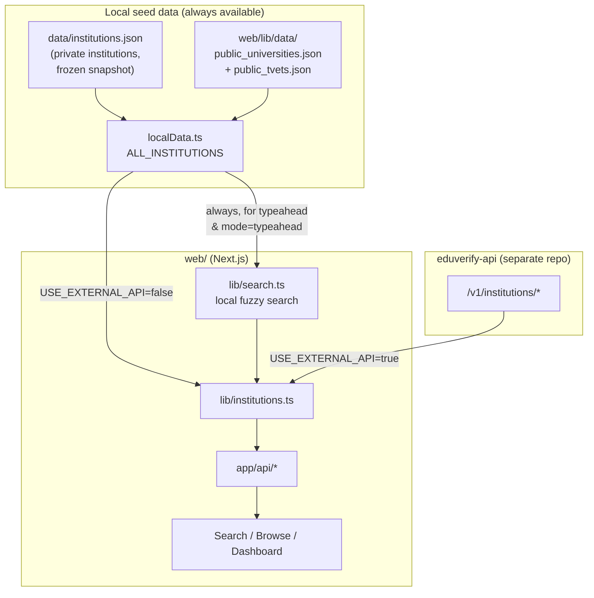
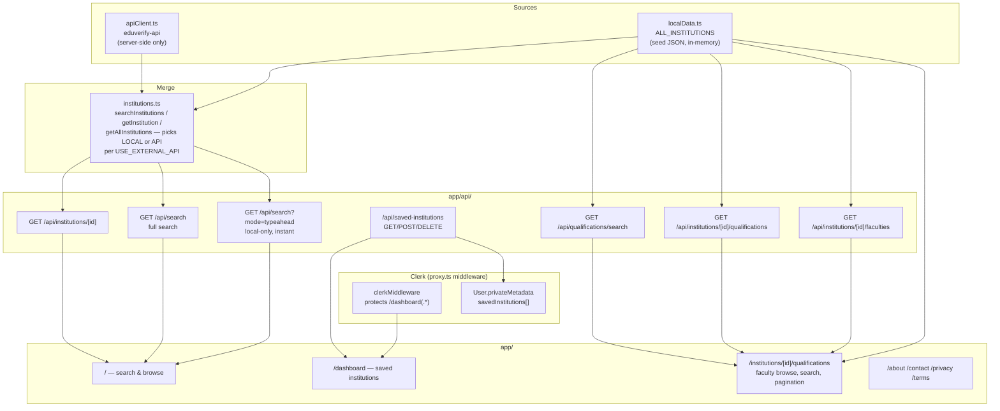

# EduVerify

EduVerify is a lookup tool for South African higher-education institutions — public universities, TVET colleges, and DHET-registered private providers — so anyone can verify that a qualification or provider is legitimate.

This repo holds the product itself:

| Part | What it does |
|---|---|
| [`web/`](web/) | Next.js product — search/browse UI, dashboard, API routes |

Institution/qualification data is served by the sibling **`eduverify-api`** repo (source of truth in DEV, STAGING, and PROD). This repo also bundles a frozen local seed snapshot ([`data/institutions.json`](data/institutions.json), [`data/qualifications.json`](data/qualifications.json)) that powers instant client-side typeahead and an offline/`USE_EXTERNAL_API=false` fallback — see [Data layer](#data-layer) below. The DHET/SAQA scraping pipeline and AWS infra that used to produce and serve that data from this repo (formerly `parser/`, `terraform/`, `scripts/`) have been retired now that `eduverify-api` owns ingestion end-to-end; nothing in this repo regenerates the seed files anymore.

## Contents

- [Data layer](#data-layer)
- [Web app](#web-app)
- [Repository layout](#repository-layout)
- [Getting started](#getting-started)
- [Testing](#testing)

## Data layer

`web/lib/institutions.ts` picks between two institution sources based on `USE_EXTERNAL_API`:



- **Local seed data** (`web/lib/localData.ts`) bundles `data/institutions.json` alongside a hand-maintained `web/lib/data/public_universities.json`/`public_tvets.json`, deduped into one always-available in-memory list (`ALL_INSTITUTIONS`) — no network call. It powers instant typeahead (`GET /api/search?mode=typeahead`) and the browse/discovery homepage unconditionally, and is also the fallback `institutions.ts` reads from when `USE_EXTERNAL_API` is unset/`false`.
- **eduverify-api** is the source of truth for full search and single-institution lookup whenever `USE_EXTERNAL_API=true` (DEV, STAGING, and PROD all set this by default — see `web/CLAUDE.md`'s Environments section). Any error on this path propagates as a real, user-visible outage; there is no automatic fallback to local data.
- **`web/lib/keys.ts`** (TypeScript) mirrors eduverify-api's own `src/lib/keys.ts` (a separate repo) so the ids this app computes for local seed institutions match what eduverify-api returns for the same institution. If this slugify algorithm ever changes, both locations must change together.

## Web app



- **`web/lib/localData.ts`** — bundles `data/institutions.json` (private institutions) plus `web/lib/data/public_universities.json` (hand-maintained public universities/TVETs, via `publicUniversities.ts`) into one deduped list, `ALL_INSTITUTIONS`.
- **`web/lib/apiClient.ts`** — the eduverify-api HTTP client (`EDUVERIFY_API_BASE_URL`/`EDUVERIFY_API_KEY`), used server-side only.
- **`web/lib/institutions.ts`** — the decision point: with `USE_EXTERNAL_API=true`, `searchInstitutions`/`getInstitution`/`getAllInstitutions` call eduverify-api and let any error propagate; with it unset/`false`, they read local seed data (`ALL_INSTITUTIONS`/`search.ts`'s fuzzy search) instead.
- **Qualifications** are pre-matched against SAQA's NLRD register (`data/qualifications.json`) and baked directly into `data/institutions.json`/`public_universities.json`/`public_tvets.json` as `faculties_and_programmes` by `web/scripts/bakeFacultiesAndProgrammes.ts` — `web/lib/facultiesAndProgrammes.ts`'s `getAllProgrammes` is the one place to read "every qualification for an institution" from, and `web/lib/qualificationsData.ts` groups/paginates them per faculty for the `/institutions/[id]/qualifications` page (client-side faculty switching, in-faculty search, 12-per-page pagination — no per-selection page reload). When no valid faculty is requested, the page defaults to an "All Qualifications" view that flattens every faculty's programmes together, rather than the first faculty alphabetically.
- **`web/lib/qualificationSearch.ts`** — typo-tolerant, word-order-independent fuzzy matching for qualification titles: a length-scaled Levenshtein distance tolerates minor misspellings, and a small dictionary expands common degree abbreviations (`phd`, `bsc`, `ba`, `nd`, `hnd`, `ma`, `msc`, `it`) to their full words. Used both by `search.ts`'s qualification-match fallback tier and by the qualifications explorer's in-faculty search box.
- **`web/lib/normalize.ts`** maps OCR-noisy/inconsistent province names in the source register to `CANONICAL_PROVINCES` (or `"Unknown"`) — the single place province-matching logic lives (search, filters, homepage hero).
- **`web/lib/location.ts`** does best-effort client-side IP geolocation (public, unauthenticated API, 2.5s timeout) to pick a default province for the homepage hero; any failure resolves to `null` and falls back to `DEFAULT_PROVINCE` ("Gauteng"). A manual province pick always wins over a late geolocation result.
- **`web/lib/collections.ts`** builds the homepage hero's Recommended/Featured/Recently Added tabs from `ALL_INSTITUTIONS` plus a province; Featured/Recently Added are omitted entirely when empty.
- **Saved institutions** live in Clerk's per-user `privateMetadata` (`web/lib/dashboardData.ts`), not a dedicated DynamoDB table — signed-in saves follow the user across devices via `/api/saved-institutions`; signed-out visitors get a local, anonymous `localStorage` set (`web/lib/savedInstitutions.ts`'s `useSavedInstitutions` hook) that isn't synced anywhere.
- **Auth** is Clerk, wired via `web/proxy.ts` — only `/dashboard(.*)` is protected.

## Repository layout

```
eduverify/
├── data/
│   ├── institutions.json          # frozen local seed snapshot, bundled by the web app
│   └── qualifications.json        # SAQA NLRD register snapshot, feeds bakeFacultiesAndProgrammes
└── web/                           # Next.js app
    ├── app/                       # routes: /, /dashboard, /api/*, /about, ...
    ├── components/                # UI + dashboard components
    ├── scripts/                   # bakeFacultiesAndProgrammes.ts
    └── lib/                       # data layer, search, normalization, keys.ts
```

## Getting started

### Web app (from `web/`)

```bash
npm install
cp .env.local.example .env.local   # fill in Clerk keys from the Clerk dashboard
npm run dev
```

By default this calls a locally-running `eduverify-api` dev server (`USE_EXTERNAL_API=true`) — see that sibling repo's README to start it, or set `USE_EXTERNAL_API=false` in `.env.local` to run entirely offline against the bundled seed data.

> This repo pins a pre-release Next.js whose APIs diverge from training data — read `web/node_modules/next/dist/docs/` before writing Next.js code, and heed its deprecation notices (`web/AGENTS.md`).

## Testing

| Suite | Command | Run from |
|---|---|---|
| Web | `npm run test` | `web/` |
| Web build | `npm run build` | `web/` |

Follow test-driven development for changes: write/update tests for the bug or requirement first, and don't consider work done until the full existing + new suite passes (see [`CLAUDE.md`](CLAUDE.md)).
