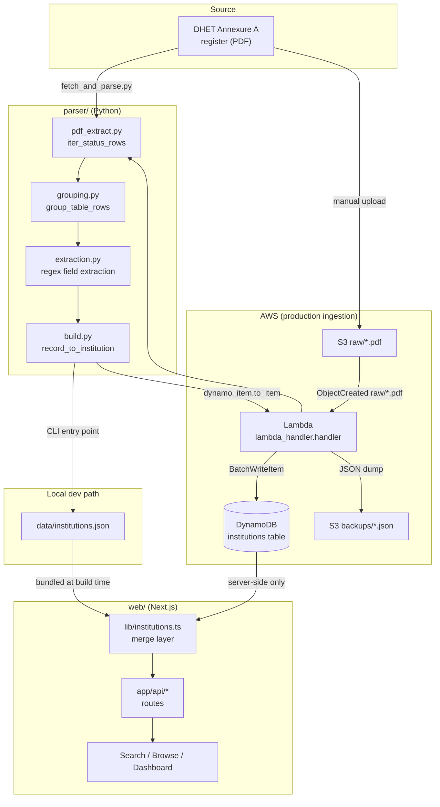
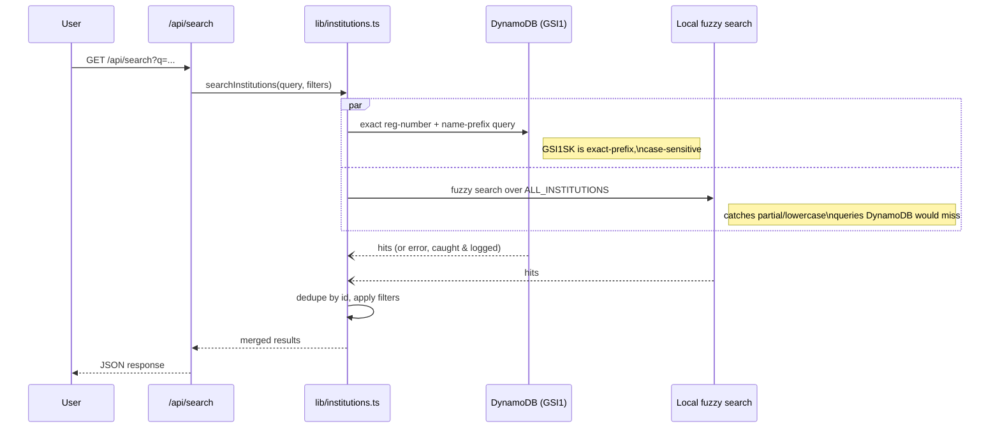
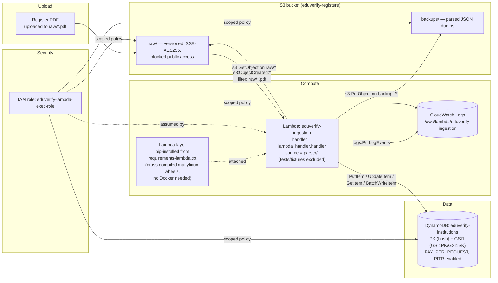
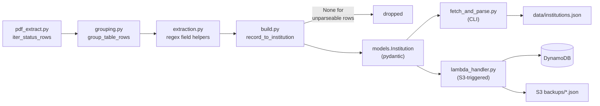
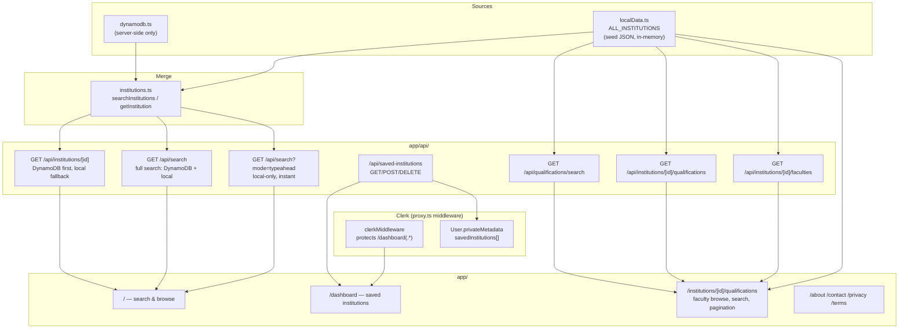

# EduVerify

EduVerify is a lookup tool for South African higher-education institutions — public universities, TVET colleges, and DHET-registered private providers — so anyone can verify that a qualification or provider is legitimate.

The repository has three independent parts that share data through [`data/institutions.json`](data/institutions.json):

| Part | What it does |
|---|---|
| [`parser/`](parser/) | Python pipelines that scrape the DHET "Annexure A" register PDF and the SAQA NLRD qualifications register into structured JSON |
| [`web/`](web/) | Next.js product — search/browse UI, dashboard, API routes |
| [`terraform/`](terraform/) + [`scripts/`](scripts/) | AWS infra (S3 → Lambda → DynamoDB) that runs the parser in production and seeds/queries the live table |

## Contents

- [EduVerify](#eduverify)
  - [Contents](#contents)
  - [System architecture](#system-architecture)
  - [Data flow](#data-flow)
  - [AWS infrastructure](#aws-infrastructure)
  - [Parser pipeline](#parser-pipeline)
    - [Institutions (DHET register)](#institutions-dhet-register)
    - [Qualifications (SAQA NLRD register)](#qualifications-saqa-nlrd-register)
  - [Web app](#web-app)
  - [Repository layout](#repository-layout)
  - [Getting started](#getting-started)
    - [Web app (from `web/`)](#web-app-from-web)
    - [Parser (from `parser/`)](#parser-from-parser)
    - [Infra (from `terraform/`)](#infra-from-terraform)
  - [Testing](#testing)

## System architecture



Both ingestion paths run the **same** parsing stages (`pdf_extract` → `grouping` → `extraction` → `build`); they differ only in where the PDF comes from and where the parsed records end up — a local JSON seed file vs. a live DynamoDB table. A separate, independent pipeline handles qualifications data (see [Parser pipeline](#parser-pipeline)).

## Data flow

Two entry points feed the same pipeline, for two different consumers:

- **Local dev / bundled seed data** — `parser/fetch_and_parse.py` downloads (or reads a local copy of) the register PDF and writes `data/institutions.json`. The web app bundles this file directly (`web/lib/localData.ts`) alongside a hand-maintained `web/lib/data/public_universities.json`, deduped into one always-available in-memory list (`ALL_INSTITUTIONS`) — no network call, powers instant typeahead and the browse/discovery homepage.
- **Production ingestion** — `parser/lambda_handler.py` runs in Lambda, triggered by an S3 `ObjectCreated` event on `raw/*.pdf`. It reuses the same parsing stages, upserts every parsed institution into DynamoDB (`dynamo_item.to_item`), and drops a JSON backup of the batch under `backups/` in the same bucket.

`dynamo_item.to_item` / `institution_key` (Python) is the single source of truth for how an institution is keyed — `INST#<registration_number>`, or `INST#NAME#<slug>` when there's no registration number. **`web/lib/keys.ts` reimplements the same slugify/key logic in TypeScript** — the two must stay in sync or web lookups by ID will silently miss DynamoDB rows.

At request time, `web/lib/institutions.ts` merges both sources:



Any DynamoDB error is caught and logged, falling back to local-only silently — it's never surfaced as a user-facing error.

## AWS infrastructure

Provisioned by Terraform ([`terraform/`](terraform/)) as modules wired together in [`main.tf`](terraform/main.tf): `s3`, `dynamodb`, `iam`, `lambda`, `ci_oidc`.



Key details:

- **S3** (`modules/s3`) — single bucket, versioned, AES256 server-side encryption, all public access blocked, bucket-owner-enforced ownership. `raw/` holds uploaded registers; `backups/` holds the Lambda's parsed-JSON dumps.
- **DynamoDB** (`modules/dynamodb`) — single table (`PK` hash key) plus `GSI1` (`GSI1PK`/`GSI1SK`, full projection) for status-partitioned name-prefix search. Pay-per-request billing, point-in-time recovery on.
- **IAM** (`modules/iam`) — least-privilege role scoped to: read `raw/*`, write `backups/*`, read/write the institutions table, query `GSI1`, and write to its own CloudWatch log group only.
- **Lambda** (`modules/lambda`) — `parser/` zipped as the function package (tests/fixtures/venv excluded); dependencies (`pdfplumber`, `pydantic`, etc.) ship as a separate layer, cross-compiled for the Lambda runtime's manylinux platform straight from `requirements-lambda.txt` via `pip install --platform ... --only-binary=:all:` — no Docker required, even from an Apple Silicon dev machine. Default: `3008MB` memory, `300s` timeout (a real ~200-page register PDF peaks near 800MB and takes ~25s to parse), `x86_64`, region `af-south-1`.
- **CI OIDC** (`modules/ci_oidc`) — an IAM role GitHub Actions assumes via OIDC (no long-lived AWS credentials in CI) to run Terraform/deploy from CI.
- The S3 → Lambda trigger (`aws_s3_bucket_notification` in `main.tf`) fires only on `ObjectCreated` events matching prefix `raw/` and suffix `.pdf`.
- **Remote state** (`backend_state.tf`) — S3 bucket + DynamoDB lock table backing `main.tf`'s `backend "s3" {}`, one per AWS account (staging and production each deploy into their own account via a dedicated IAM Identity Center SSO profile — see `docs/DEPLOYMENT.md`); each is bootstrapped once with local state before the backend it creates can be used.
- **Amplify Hosting** (`frontend.tf`) — has no regional endpoint in `af-south-1`, so it deploys via a separate `aws.amplify` provider alias into `eu-west-1` while everything else stays in `af-south-1`.
- **Scheduled ingestion** (`eventbridge.tf`) — a weekly EventBridge rule invokes the Lambda directly, but `lambda_handler.handler` currently only handles the S3 event shape, so this invocation is a no-op today.
- **Monitoring** (`monitoring.tf`) — SNS topic (`eduverify-alerts`, optional email subscription) plus CloudWatch alarms on Lambda `Errors`/`Throttles`.

Operational scripts:

```bash
./scripts/verify_deployment.sh                                        # production pre-flight (see docs/DEPLOYMENT.md)
cd terraform && terraform plan   # / apply — provisions everything above
python scripts/seed_dynamodb.py                                       # bulk-load data/institutions.json
python scripts/seed_dynamodb.py --endpoint-url http://localhost:8000  # against DynamoDB Local
```

## Parser pipeline

### Institutions (DHET register)

One-way, composable stages in [`parser/`](parser/), each independently unit-tested and side-effect-free where possible:



1. **`pdf_extract.iter_status_rows`** — walks the PDF via `pdfplumber`, tagging every table row with the registration-status section it's under. The Annexure A register has 6 numbered sections, all of which are surfaced (none are silently dropped): Registered, Provisionally Registered, and a differently-shaped Cancelled/Discontinued/Bogus set handled by `iter_name_list_entries`/`group_bogus_rows` — see `parser/CLAUDE.md` for the full section-by-section breakdown.
2. **`grouping.group_table_rows`** — the DHET table wraps one institution across multiple physical rows (and page breaks); a new record starts only when the leading index column (`"1."`, `"2."`, ...) is populated — everything else is a continuation appended to the current record.
3. **`extraction.py`** — pure regex helpers pulling structured fields (name, phones, emails, website, registration number, address, qualification list) out of a grouped record's raw multi-line cell text.
4. **`build.record_to_institution`** — assembles a validated `models.Institution` (pydantic) from a grouped record, returning `None` for unparseable rows rather than raising.

### Qualifications (SAQA NLRD register)

A second, independent pipeline — no institution-matching happens here (that's `web/lib/qualificationsMatching.ts`, downstream in the web app):

- **`fetch_and_parse_qualifications.py`** — downloads (or reads a local copy of) SAQA's "All Qualifications and Part-Qualifications" xlsx register and writes `data/qualifications.json`.
- **`qualifications_extract.build_qualifications`** — reads the xlsx via `openpyxl` and validates every row into a `models.SaqaQualification`, keeping its NQF Sub-Framework (`HEQSF`, `OQSF`, `GFETQSF`, `SFAP`, `SFNA`) as a `framework` field. Filtering to `HEQSF` — the only sub-framework relevant to a higher-education product — happens at consumption time, not here: `web/scripts/bakeFacultiesAndProgrammes.ts` applies that filter when matching qualifications to institutions, so other frameworks stay available in `data/qualifications.json` for non-HEQSF consumers (e.g. `eduverify-api`'s CV/HR qualification matcher).

`data/qualifications.json` feeds `web/scripts/bakeFacultiesAndProgrammes.ts`, which matches HEQSF qualifications to institutions and bakes the result into the institution JSON files the web app bundles (see [Web app](#web-app)).

## Web app



- **`web/lib/localData.ts`** — bundles `data/institutions.json` (private institutions, scraped) plus `web/lib/data/public_universities.json` (hand-maintained public universities/TVETs, via `publicUniversities.ts`) into one deduped list, `ALL_INSTITUTIONS`.
- **`web/lib/dynamodb.ts`** — the live register; single-table design, `PK` = institution key, `GSI1PK` = uppercased status, `GSI1SK` = name. Server-side only.
- **`web/lib/institutions.ts`** — the merge point: `searchInstitutions` queries DynamoDB (exact registration-number + name-prefix) and always also runs local fuzzy search in parallel, deduping by id. Any DynamoDB error falls back to local-only, silently.
- **Qualifications** are pre-matched against SAQA's NLRD register (`data/qualifications.json`) and baked directly into `data/institutions.json`/`public_universities.json`/`public_tvets.json` as `faculties_and_programmes` by `web/scripts/bakeFacultiesAndProgrammes.ts` — `web/lib/facultiesAndProgrammes.ts`'s `getAllProgrammes` is the one place to read "every qualification for an institution" from, and `web/lib/qualificationsData.ts` groups/paginates them per faculty for the `/institutions/[id]/qualifications` page (client-side faculty switching, in-faculty search, 12-per-page pagination — no per-selection page reload). When no valid faculty is requested, the page defaults to an "All Qualifications" view that flattens every faculty's programmes together, rather than the first faculty alphabetically.
- **`web/lib/qualificationSearch.ts`** — typo-tolerant, word-order-independent fuzzy matching for qualification titles: a length-scaled Levenshtein distance tolerates minor misspellings, and a small dictionary expands common degree abbreviations (`phd`, `bsc`, `ba`, `nd`, `hnd`, `ma`, `msc`, `it`) to their full words. Used both by `search.ts`'s qualification-match fallback tier and by the qualifications explorer's in-faculty search box.
- **`web/lib/normalize.ts`** maps OCR-noisy/inconsistent province names in the source register to `CANONICAL_PROVINCES` (or `"Unknown"`) — the single place province-matching logic lives (search, filters, homepage hero).
- **`web/lib/location.ts`** does best-effort client-side IP geolocation (public, unauthenticated API, 2.5s timeout) to pick a default province for the homepage hero; any failure resolves to `null` and falls back to `DEFAULT_PROVINCE` ("Gauteng"). A manual province pick always wins over a late geolocation result.
- **`web/lib/collections.ts`** builds the homepage hero's Recommended/Featured/Recently Added tabs from `ALL_INSTITUTIONS` plus a province; Featured/Recently Added are omitted entirely when empty.
- **Saved institutions** live in Clerk's per-user `privateMetadata` (`web/lib/dashboardData.ts`), not a dedicated DynamoDB table — signed-in saves follow the user across devices via `/api/saved-institutions`; signed-out visitors get a local, anonymous `localStorage` set (`web/lib/savedInstitutions.ts`'s `useSavedInstitutions` hook) that isn't synced anywhere.
- **Auth** is Clerk, wired via `web/proxy.ts` — only `/dashboard(.*)` is protected.

## Repository layout

```
eduverify/
├── data/
│   ├── institutions.json          # parsed output, bundled by the web app
│   ├── qualifications.json        # SAQA NLRD register, feeds bakeFacultiesAndProgrammes
│   └── _annexure_a_register.pdf   # source register (local dev copy)
├── parser/                        # Python scraping pipelines
│   ├── pdf_extract.py / grouping.py / extraction.py / build.py / models.py
│   ├── dynamo_item.py             # institution keying (source of truth)
│   ├── fetch_and_parse.py         # CLI entry point → data/institutions.json
│   ├── fetch_and_parse_qualifications.py  # CLI entry point → data/qualifications.json
│   ├── qualifications_extract.py  # SAQA NLRD xlsx parsing
│   ├── lambda_handler.py          # S3-triggered entry point → DynamoDB
│   └── tests/
├── web/                           # Next.js app
│   ├── app/                       # routes: /, /dashboard, /api/*, /about, ...
│   ├── components/                # UI + dashboard components
│   └── lib/                       # data layer, search, normalization, keys.ts
├── terraform/                     # AWS infra (S3 → Lambda → DynamoDB)
│   └── modules/{s3,dynamodb,iam,lambda,ci_oidc}/
└── scripts/
    └── seed_dynamodb.py           # bulk-load data/institutions.json into DynamoDB
```

## Getting started

### Web app (from `web/`)

```bash
npm install
cp .env.local.example .env.local   # fill in Clerk keys from the Clerk dashboard
npm run dev
```

> This repo pins a pre-release Next.js whose APIs diverge from training data — read `web/node_modules/next/dist/docs/` before writing Next.js code, and heed its deprecation notices (`web/AGENTS.md`).

### Parser (from `parser/`)

```bash
python -m venv .venv && source .venv/bin/activate
pip install -r requirements.txt
python fetch_and_parse.py                    # download latest DHET PDF → ../data/institutions.json
python fetch_and_parse.py --pdf-path FILE    # parse an already-downloaded PDF instead
python fetch_and_parse_qualifications.py     # download latest SAQA NLRD xlsx → ../data/qualifications.json
```

### Infra (from `terraform/`)

```bash
terraform plan   # / apply — provisions S3, DynamoDB, Lambda, IAM
```

## Testing

| Suite | Command | Run from |
|---|---|---|
| Parser | `python -m pytest` | `parser/` (inside its `.venv`) |
| Web | `npm run test` | `web/` |
| Web build | `npm run build` | `web/` |

Follow test-driven development for changes: write/update tests for the bug or requirement first, and don't consider work done until the full existing + new suite passes (see [`CLAUDE.md`](CLAUDE.md)).
